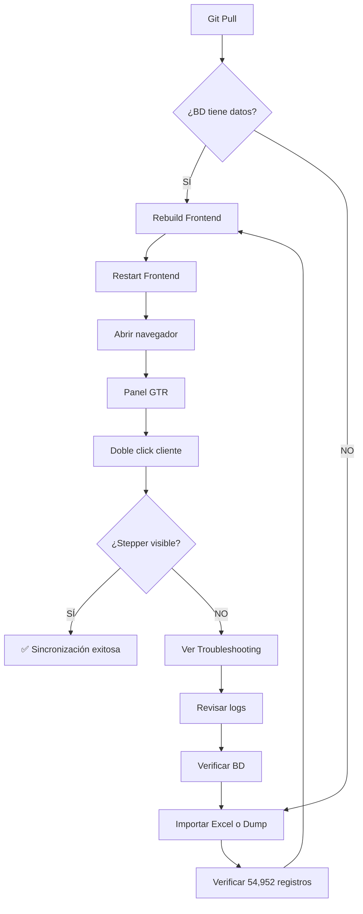

# 🎨 Sincronización de Mejoras Visuales del Stepper de Historial

**Fecha:** 18 de noviembre de 2025  
**Cambios:** Mejoras visuales del stepper horizontal en modal de historial de gestiones  
**Origen:** Laptop Dario → Servidor Empresa

---

## 📋 Resumen de Cambios

Se aplicaron mejoras visuales significativas al **stepper horizontal** del modal de historial de gestiones en el panel GTR. El stepper ahora usa colores dinámicos por categoría con efectos visuales profesionales (gradientes, sombras, animaciones hover).

### Archivos Modificados:
- ✅ `src/components/gtr/ClientHistoryDialog.tsx` (mejoras visuales del stepper)

### Base de Datos:
- ⚠️ **IMPORTANTE:** El servidor necesita tener los datos en la tabla `historial_gestiones`
- ✅ Frontend solo lee de BD (mejoras visuales)
- 📊 Total a importar: **54,952 registros** de gestiones históricas

---

## 🚀 Pasos de Sincronización

### **PASO 0: Verificar si la BD tiene los datos del historial** 🔍

**ANTES de hacer cualquier cosa, verificar:**

```bash
# Conectar a la BD del servidor
docker exec -it albru-mysql mysql -u root -proot_password albru

# Ejecutar consulta
SELECT COUNT(*) as total FROM historial_gestiones;
```

**Resultado esperado:**
- Si muestra `54952` → ✅ **Ya tiene los datos, pasar al PASO 1**
- Si muestra `0` o `Table doesn't exist` → ⚠️ **Necesita importar datos, seguir PASO 0A**

---

### **PASO 0A: Importar datos del historial (SI NO EXISTEN)** 📥

**Solo ejecutar si la BD NO tiene los datos del historial.**

#### **Opción 1: Importar desde Excel** (Recomendado si tienes el archivo)

```bash
# 1. El archivo Excel ya viene en el repositorio: aña.xlsx
# 2. Crear la tabla (si no existe)
docker exec -i albru-mysql mysql -u root -proot_password albru < database/create-historial-gestiones.sql

# 3. Ejecutar script de importación
node importar-historial-gestiones.cjs

# Progreso esperado:
# ✓ Conectando a base de datos...
# ✓ Leyendo Excel: aña.xlsx
# ✓ Procesando 54,952 registros...
# ✓ Insertando en lotes de 1000...
# ✓ Importación completada: 54,952 registros insertados
```

#### **Opción 2: Transferir dump SQL desde laptop** (Si ya está importado en laptop)

```bash
# EN LA LAPTOP (generar dump):
docker exec albru-mysql mysqldump -u root -proot_password albru historial_gestiones > historial_gestiones_dump.sql

# Transferir el archivo al servidor (vía USB, red, etc.)

# EN EL SERVIDOR (restaurar):
# 1. Crear la tabla primero
docker exec -i albru-mysql mysql -u root -proot_password albru < database/create-historial-gestiones.sql

# 2. Importar los datos
docker exec -i albru-mysql mysql -u root -proot_password albru < historial_gestiones_dump.sql
```

**Verificación post-importación:**
```bash
docker exec -it albru-mysql mysql -u root -proot_password albru -e "SELECT COUNT(*) FROM historial_gestiones; SELECT categoria, COUNT(*) as total FROM historial_gestiones GROUP BY categoria ORDER BY total DESC LIMIT 5;"

# Debe mostrar:
# COUNT(*): 54952
# Top 5 categorías con conteos
```

---

### **PASO 1: Pull del repositorio Git** 🔄

```bash
# En la PC del servidor
cd /ruta/a/albru-brunario

# Asegurar rama main
git checkout main

# Pull de los cambios
git pull origin main
```

**Verificación:**
```bash
# Confirmar que el archivo fue actualizado
git log --oneline -1 src/components/gtr/ClientHistoryDialog.tsx

# Debe mostrar el commit más reciente con las mejoras visuales
```

---

### **PASO 2: Rebuild del Frontend** 🔨

El frontend necesita reconstruirse para compilar los cambios en el componente React:

```bash
# Rebuild SOLO del frontend (sin cache para asegurar cambios)
docker-compose build --no-cache frontend

# Reiniciar el contenedor
docker-compose restart frontend
```

**Verificación:**
```bash
# Confirmar que el contenedor está corriendo
docker ps | grep frontend

# Debe mostrar "albru-frontend" con estado "Up"
```

---

### **PASO 3: Verificación Visual** 👀

1. Abrir navegador: `http://localhost:5173` (o IP del servidor)

2. Navegar a: **Panel GTR** → Tabla de clientes

3. **Doble click** en cualquier cliente con historial (ej: cliente ID 11225 tiene 47 gestiones)

4. **Verificar el stepper horizontal** en la parte superior del modal:

   ✅ **Círculos grandes con gradiente**  
   ✅ **Colores diferentes según categoría**  
   ✅ **Sombras con efecto de profundidad**  
   ✅ **Bordes blancos de 4px**  
   ✅ **Hover con scale y elevación**  
   ✅ **Chips estilizados para categorías**  
   ✅ **Línea conectora con gradiente sutil**

---

## 🎨 Características del Nuevo Diseño

### **Círculos del Stepper:**
- Tamaño: **56x56px** (antes 50x50px)
- Gradiente dinámico usando colores de categoría
- Sombra doble: `0 4px 14px` + `0 2px 8px` con color matching
- Borde blanco de **4px** para destacar
- Anillo externo con pseudo-elemento `::before`

### **Animaciones:**
- Hover: `scale(1.15)` + `translateY(-3px)`
- Sombra intensa al hover: `0 8px 20px` + `0 4px 12px`
- Transición suave: `0.3s ease`

### **Labels:**
- Título en **2 líneas** con elipsis inteligente
- Chip estilizado para categoría (cuando hay subcategoría)
- Fecha compacta: "18 nov" (día + mes corto)
- Colores consistentes con tarjetas detalladas

### **Paleta de Colores por Categoría:**

```typescript
Lista negra        → #1e293b (Negro oscuro)
Preventa completa  → #22c55e (Verde)
Preventa           → #f59e0b (Naranja)
Agendado           → #3b82f6 (Azul)
Seguimiento        → #8b5cf6 (Púrpura)
Rechazado          → #ef4444 (Rojo)
Retirado           → #64748b (Gris)
Sin facilidades    → #f97316 (Naranja oscuro)
Sin contacto       → #94a3b8 (Gris claro)
```

---

## 🔍 Comparación Antes/Después

### **ANTES:**
- Círculos verdes uniformes (#22c55e)
- Sin gradientes
- Sombra simple
- Borde 3px
- Hover básico (scale 1.1)

### **DESPUÉS:**
- Círculos con gradiente dinámico por categoría
- Doble sombra con color matching
- Borde 4px con anillo externo
- Hover mejorado (scale 1.15 + elevación)
- Chips estilizados para categorías
- Línea conectora con gradiente

---

## 📊 Datos de Prueba

Para testing completo, usar estos clientes que tienen múltiples gestiones:

| Cliente ID | Nombre                    | Total Gestiones | Categorías Variadas |
|------------|---------------------------|-----------------|---------------------|
| 11225      | (buscar en BD)            | 47              | ✅ Sí               |
| 13829      | (buscar en BD)            | 44              | ✅ Sí               |
| 13644      | (buscar en BD)            | 44              | ✅ Sí               |

**Query para verificar datos:**
```sql
SELECT 
  paso, 
  asesor_nombre, 
  categoria, 
  subcategoria, 
  fecha_gestion 
FROM historial_gestiones 
WHERE cliente_id = 11225 
ORDER BY paso ASC 
LIMIT 10;
```

**Resultado esperado:**
```
paso=1: NATALY, Sin contacto, No contesta, 2024-11-15 04:54:00
paso=1: ALEXANDRO, Seguimiento, Gestión o chat, 2024-11-15 04:55:00
paso=2: JEANCARLOS, Sin contacto, No contesta, 2024-11-15 04:54:00
... (10 registros con múltiples categorías y colores)
```

---

## 📦 Archivos Incluidos en el Repositorio

Para facilitar la sincronización completa, el repositorio ahora incluye:

1. **`src/components/gtr/ClientHistoryDialog.tsx`**
   - Componente con mejoras visuales del stepper

2. **`database/create-historial-gestiones.sql`**
   - Script SQL para crear la tabla `historial_gestiones`
   - Incluye índices, relaciones y comentarios

3. **`importar-historial-gestiones.cjs`**
   - Script Node.js para importar datos desde Excel
   - Maneja encoding Unicode y mapeo de tipificaciones

4. **`aña.xlsx`**
   - Archivo Excel con 54,952 gestiones históricas
   - Incluye columnas: Paso, Asesor, Categoría, Subcategoría, Fecha, Observaciones

5. **`fix-encoding.cjs`**
   - Utilidad para corregir problemas de encoding Unicode

**Total de datos:** 54,952 registros → 13,686 clientes únicos → 81 asesores → 26 categorías

---

## 🛠️ Troubleshooting

### **Problema: No se ven los cambios visuales**

**Solución 1:** Limpiar cache del navegador
```
Ctrl + Shift + R (forzar recarga sin cache)
```

**Solución 2:** Rebuild completo con limpieza
```bash
# Detener contenedores
docker-compose down

# Eliminar imagen vieja
docker rmi albru-brunario-frontend

# Rebuild desde cero
docker-compose build --no-cache frontend
docker-compose up -d
```

**Solución 3:** Verificar que el archivo fue actualizado
```bash
# Ver últimas líneas del archivo (debe incluir nuevos estilos)
tail -100 src/components/gtr/ClientHistoryDialog.tsx | grep "linear-gradient"

# Debe mostrar líneas con gradientes y sombras
```

---

### **Problema: Error de compilación TypeScript**

**Síntoma:** `Cannot find name 'Chip'`

**Solución:** Verificar que el import incluye Chip:
```typescript
import {
  Dialog,
  DialogTitle,
  DialogContent,
  DialogActions,
  Button,
  Box,
  Typography,
  Paper,
  Divider,
  Avatar,
  TextField,
  Chip  // ← Debe estar presente
} from '@mui/material';
```

---

### **Problema: Stepper no muestra gestiones (tabla vacía)**

**Diagnóstico:**
```bash
# Conectar a la BD
docker exec -it albru-mysql mysql -u root -proot_password albru

# Verificar que hay datos en historial_gestiones
SELECT COUNT(*) FROM historial_gestiones;
-- Debe retornar: 54952

# Verificar que el cliente tiene gestiones
SELECT COUNT(*) FROM historial_gestiones WHERE cliente_id = 11225;
-- Debe retornar: 47
```

**Solución:** Si retorna 0 o error "Table doesn't exist":
1. Volver al **PASO 0A** de este documento
2. Importar los datos desde Excel o dump SQL
3. Verificar que la importación fue exitosa

**Importación desde Excel:**
```bash
# 1. Verificar que el archivo existe
ls -la aña.xlsx

# 2. Crear la tabla
docker exec -i albru-mysql mysql -u root -proot_password albru < database/create-historial-gestiones.sql

# 3. Ejecutar importación
node importar-historial-gestiones.cjs

# 4. Verificar resultado
docker exec -it albru-mysql mysql -u root -proot_password albru -e "SELECT COUNT(*) FROM historial_gestiones;"
```

**Si el script de importación falla:**
```bash
# Ver errores detallados
node importar-historial-gestiones.cjs 2>&1 | tee import-errors.log

# Revisar el log
cat import-errors.log

# Errores comunes:
# - "Cannot find module 'xlsx'" → npm install
# - "Cannot connect to database" → Verificar contenedor MySQL
# - "Duplicate entry" → Tabla ya tiene datos, truncar primero:
#   docker exec -it albru-mysql mysql -u root -proot_password albru -e "TRUNCATE TABLE historial_gestiones;"
```

---

### **Problema: Modal abre pero stepper está vacío**

**Diagnóstico:**
1. Abrir DevTools (F12) → Console
2. Ver si hay errores de red o JavaScript
3. Verificar Network tab: debe haber request a `/api/clientes/:id/historial-gestiones`

**Soluciones:**

**A) Si no hay request al endpoint:**
```bash
# Verificar que el backend está corriendo
docker ps | grep backend

# Ver logs del backend
docker logs albru-backend --tail 50
```

**B) Si el endpoint retorna error 500:**
```bash
# Ver logs detallados del backend
docker logs albru-backend -f

# Buscar errores SQL relacionados con historial_gestiones
```

**C) Si el endpoint retorna datos vacíos:**
```sql
-- Verificar que el cliente existe y tiene gestiones
SELECT c.id, c.nombre, COUNT(hg.id) as total_gestiones
FROM clientes c
LEFT JOIN historial_gestiones hg ON c.id = hg.cliente_id
WHERE c.id = 11225
GROUP BY c.id;

-- Debe mostrar: id=11225, total_gestiones=47
```

---

### **Problema: Errores durante importación del Excel**

**Error: "Cannot find module 'xlsx'"**
```bash
npm install
# o específicamente
npm install xlsx mysql2
```

**Error: "File not found: aña.xlsx"**
```bash
# Verificar ubicación del archivo
ls -la *.xlsx

# Si está en otra ubicación, moverlo:
mv /ruta/actual/aña.xlsx ./aña.xlsx
```

**Error: "Encoding issues" (caracteres raros en nombres)**
```bash
# Usar el script de fix de encoding
node fix-encoding.cjs

# Luego ejecutar importación nuevamente
node importar-historial-gestiones.cjs
```

**Error: "Duplicate entry for key 'PRIMARY'"**
```bash
# La tabla ya tiene datos, truncar primero
docker exec -it albru-mysql mysql -u root -proot_password albru -e "TRUNCATE TABLE historial_gestiones;"

# Luego importar nuevamente
node importar-historial-gestiones.cjs
```

---

## 🎯 Flujo Completo Resumido



---

### **Problema: Stepper no muestra gestiones**

**Diagnóstico:**
```sql
-- Verificar que hay datos en historial_gestiones
SELECT COUNT(*) FROM historial_gestiones;
-- Debe retornar: 54952

-- Verificar que el cliente tiene gestiones
SELECT COUNT(*) FROM historial_gestiones WHERE cliente_id = 11225;
-- Debe retornar: 47
```

**Solución:** Si no hay datos, revisar que la importación del historial se completó correctamente (ver `MD/INSTRUCCIONES-SINCRONIZAR-HISTORIAL-GESTIONES.md`).

---

## ✅ Checklist de Sincronización

Usa este checklist para confirmar que todo quedó correcto:

- [ ] **Git pull ejecutado** sin conflictos
- [ ] **Archivo actualizado:** `ClientHistoryDialog.tsx` tiene nuevos estilos
- [ ] **Frontend rebuildeado** sin errores de compilación
- [ ] **Contenedor reiniciado** y corriendo
- [ ] **Modal abre correctamente** al doble click
- [ ] **Stepper visible** en parte superior del modal
- [ ] **Círculos con gradiente** de colores dinámicos
- [ ] **Sombras con profundidad** visibles
- [ ] **Bordes blancos gruesos** de 4px
- [ ] **Hover funciona:** círculos se agrandan y elevan
- [ ] **Chips de categoría** visibles cuando hay subcategoría
- [ ] **Línea conectora** con gradiente sutil
- [ ] **Colores diferentes** por tipo de gestión
- [ ] **Responsive:** scroll horizontal funciona
- [ ] **Performance:** transiciones suaves sin lag

---

## 📝 Notas Importantes

### **Compatibilidad:**
- ✅ Compatible con datos existentes en `historial_gestiones`
- ✅ No afecta funcionalidad del backend
- ✅ No requiere cambios en BD
- ✅ Mantiene compatibilidad con historial antiguo

### **Impacto:**
- 🎨 **Solo visual:** Mejora UX sin cambiar lógica
- ⚡ **Performance:** Sin impacto significativo
- 📱 **Responsive:** Funciona en diferentes tamaños de pantalla

### **Reversión (si es necesario):**
```bash
# Volver a versión anterior
git log --oneline src/components/gtr/ClientHistoryDialog.tsx
git checkout <commit-anterior> src/components/gtr/ClientHistoryDialog.tsx
docker-compose build --no-cache frontend
docker-compose restart frontend
```

---

## 🎯 Resultado Final Esperado

Al abrir el modal de historial de un cliente con múltiples gestiones, deberías ver:

1. **Stepper horizontal** en la parte superior
2. Cada paso representado por un **círculo grande con gradiente**
3. **Colores diferentes** según la categoría (verde, azul, púrpura, naranja, rojo, etc.)
4. **Sombras profundas** que dan sensación de elevación
5. **Bordes blancos gruesos** que destacan cada círculo
6. **Efecto hover suave:** círculos se agrandan y elevan al pasar el mouse
7. **Chips estilizados** mostrando la categoría principal
8. **Fecha compacta** en formato "18 nov"
9. **Línea conectora** con gradiente sutil entre círculos
10. Abajo, las **tarjetas detalladas** con diseño consistente

---

## 🤝 Soporte

Si encuentras algún problema durante la sincronización:

1. **Verificar logs del frontend:**
   ```bash
   docker logs albru-frontend
   ```

2. **Verificar errores de compilación:**
   ```bash
   docker-compose logs frontend | grep -i error
   ```

3. **Revisar consola del navegador** (F12) para errores JavaScript

4. **Comparar con esta guía** paso a paso

---

## 📚 Documentación Relacionada

- `MD/INSTRUCCIONES-SINCRONIZAR-HISTORIAL-GESTIONES.md` - Importación inicial del historial
- `MD/EJECUTAR-IMPORTACION.md` - Guía de importación desde Excel
- `MD/GUIA-PARA-TI.md` - Contexto general del proyecto

---

**✅ Una vez completados todos los pasos, el stepper visual mejorado estará operativo en el servidor de la empresa.**
